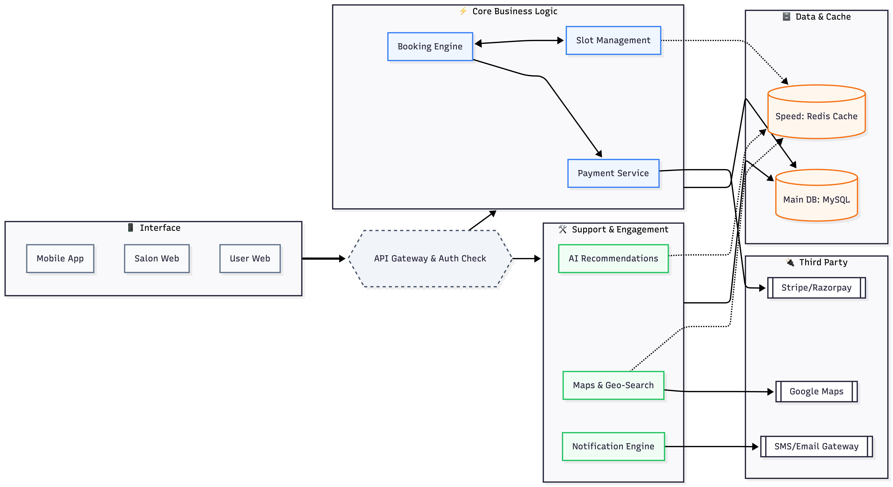

# BookMySalon

Modern salon booking platform with real-time chat, payments, and analytics.


## Overview
BookMySalon is a full-stack application that lets customers discover salons, book services, pay securely, and chat with salon owners. It includes role-based authentication, reviews, service catalogs, and real-time notifications.

## Architecture




## Key Features
- JWT-based authentication with access/refresh tokens.
- Role-based access for customers and salon owners.
- Salon discovery, categories, and service offerings.
- Booking lifecycle with cancel/reschedule support.
- Stripe payment flow with success/failure handling.
- OTP-based signup/verification (Twilio/MSG91 optional).
- Real-time chat and notifications using WebSocket/STOMP.
- Analytics, recommendations, and dynamic pricing logic.

## Tech Stack
- Backend: Java 21, Spring Boot 3.5, Spring Security, JPA, Flyway, WebSocket/STOMP
- Frontend: React 18, Vite, Tailwind CSS, Axios, Framer Motion
- Payments/Comms: Stripe, Twilio (optional), MSG91 (optional)
- DB: MySQL (persistent runtime), H2 (tests only)
- Deploy: Docker + Render

## Repository Layout
- `bookmysalon-app`: Main Spring Boot backend (active source).
- `frontend`: React application.
- `architecture-images`: Architecture diagrams.
- `Architecture`: Logo and system diagram.
- `setup.sh`: One-shot setup script.
- `Dockerfile`: Backend container build.
- `render.yaml`: Render deployment config.

Note: There are service folders like `booking-service`, `gateway-server`, etc. They currently contain build outputs only and are not the active source used by the app.

## Quick Start
```bash
./setup.sh
```
Then open `http://localhost:5173`.

## Manual Setup
### Backend
```bash
cd bookmysalon-app
mvn clean install -DskipTests
java -jar target/bookmysalon-app-1.0.0.jar
```

### Frontend
```bash
cd frontend
npm install
npm run dev
```

## Environment Configuration
Backend config lives in `bookmysalon-app/src/main/resources/application.yml`. Key variables:
- `SPRING_DATASOURCE_URL`
- `SPRING_DATASOURCE_USERNAME`
- `SPRING_DATASOURCE_PASSWORD`
- `SECURITY_JWT_SECRET`
- `STRIPE_API_KEY`
- `APP_CORS_ALLOWED_ORIGIN_PATTERNS`
- `APP_OTP_DEV_MODE`
- `OTP_EMAIL_ENABLED`
- `OTP_EMAIL_FROM`
- `SPRING_MAIL_HOST`
- `SPRING_MAIL_PORT`
- `SPRING_MAIL_USERNAME`
- `SPRING_MAIL_PASSWORD`
- `APP_OAUTH2_ENABLED`
- `GOOGLE_CLIENT_ID`
- `GOOGLE_CLIENT_SECRET`
- `APP_OAUTH2_REDIRECT_URI`
- `APP_OAUTH2_FAILURE_URI`
- `MSG91_ENABLED`
- `MSG91_AUTHKEY`
- `OTP_SMS_ENABLED`
- `OTP_SMS_DEFAULT_COUNTRY_CODE`
- `TWILIO_ACCOUNT_SID`
- `TWILIO_AUTH_TOKEN`
- `TWILIO_FROM_NUMBER`

Security note:
- Keep all backend secrets only in Render environment variables (never in git).
- For Vercel, only use `VITE_*` variables. These are client-side and visible in browser bundles.
- Never put secret keys like `STRIPE_API_KEY`, `GOOGLE_CLIENT_SECRET`, `SECURITY_JWT_SECRET`, Twilio auth token, or DB passwords in frontend env files.

## Local Persistent Database Setup (MySQL)
BookMySalon backend can run with persistent local MySQL:
- Database: `bookmysalon`
- Host: `localhost`
- Port: `3306`
- Username: set via `SPRING_DATASOURCE_USERNAME`
- Password: set via `SPRING_DATASOURCE_PASSWORD`

Create/reset local schema:
```bash
mysql -u root -p < bookmysalon-app/sql/local-init.sql
```
Optional full reset (destructive):
```bash
mysql -u root -p < bookmysalon-app/sql/reset-schema.sql
```

## API Surface (Highlights)
Base path: `/api`
- Auth: `/api/auth`
- Salons: `/api/salons`
- Bookings: `/api/bookings`
- Reviews: `/api/reviews`
- Payments: `/api/payments`
- Categories: `/api/categories`
- Notifications: `/api/notifications`

## Deployment
The backend is containerized with the root `Dockerfile`. Render config is in `render.yaml`.

## Screenshots
Add product screenshots here if available.

## Author
Prahlad Yadav
