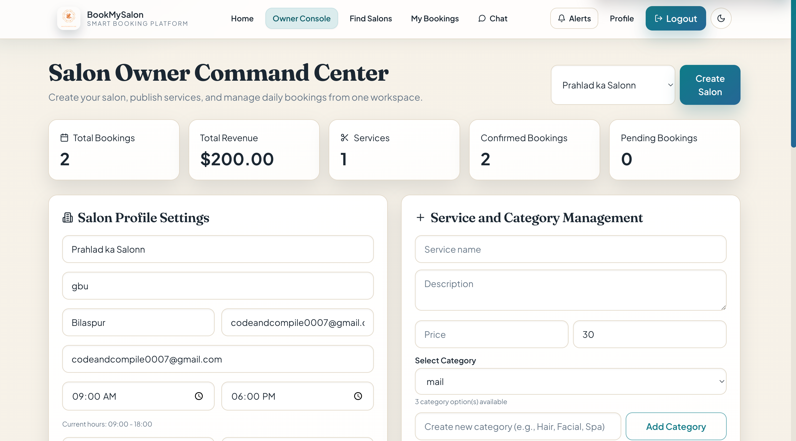
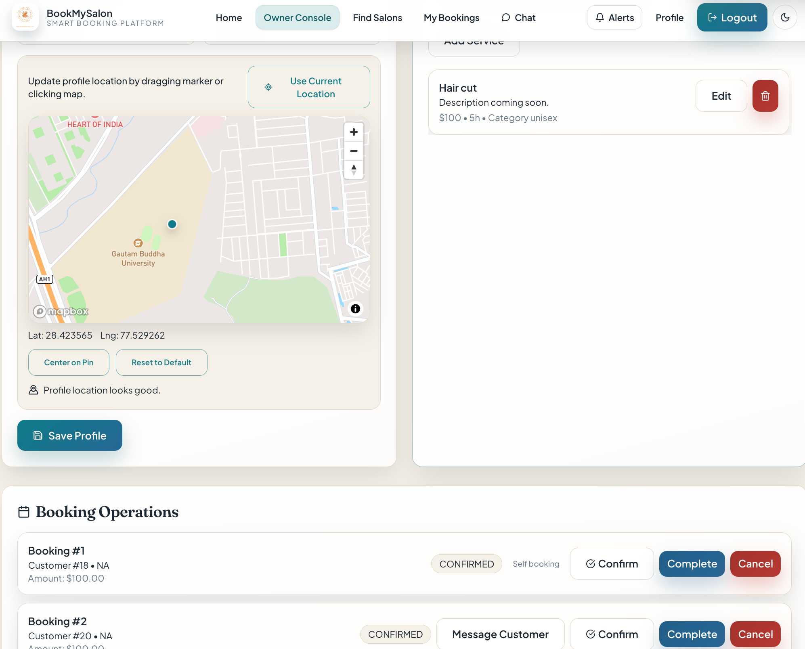
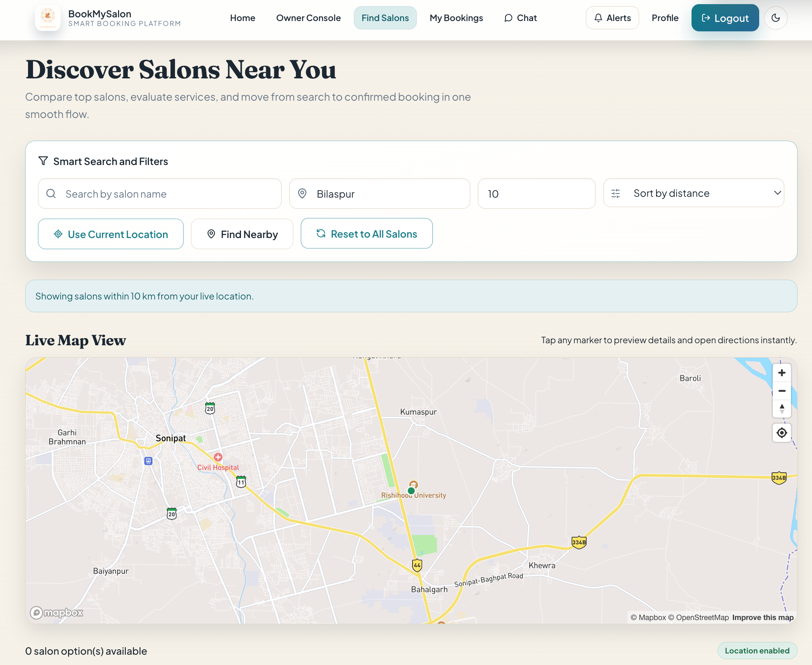
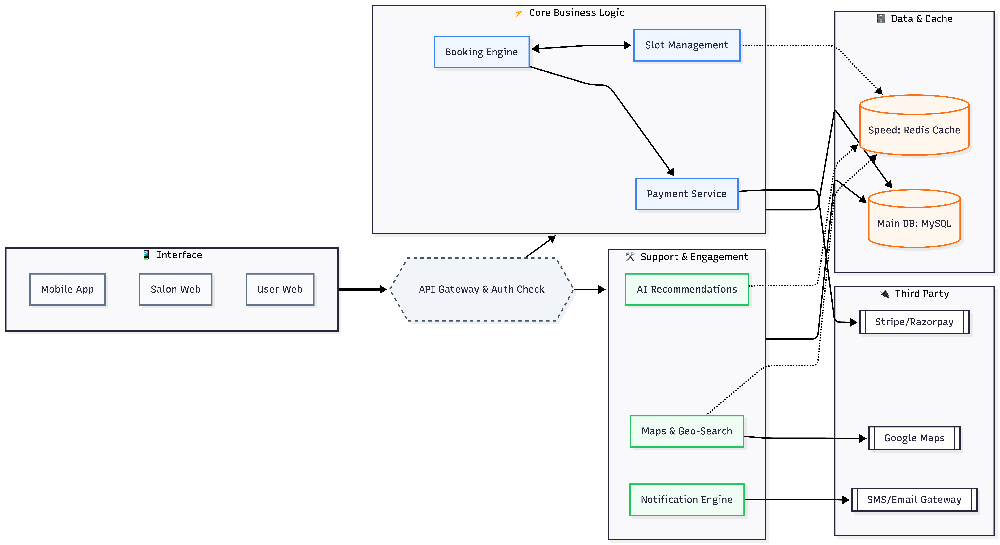

# BookMySalon


BookMySalon is a full-stack salon booking platform with a Spring Boot backend and React frontend.  
It supports role-based authentication, salon discovery, booking management, reviews, chat, and notifications.

## Project Screenshots

| Preview 1 | Preview 2 | Preview 3 |
| --- | --- | --- |
|  |  |  |

## Architecture Snapshot



## Current Project Status

This repository currently runs as a **monolith + SPA**:

- `bookmysalon-app`: Active Spring Boot backend (auth, booking, reviews, chat, notifications, payments).
- `frontend`: Active React + Vite frontend (customer, salon owner, and admin flows).

These folders are present but not active runtime services in the current repo state:

- `booking-service`, `category-service`, `gateway-server`, `notification-service`, `payment-service`
- `review-service`, `salon-service`, `service-offering-service`, `user-service`, `eureka-server`

## Feature Highlights

### Authentication & Authorization

- JWT access + refresh token flow
- Register/login with email and password
- OTP-based signup (`initiate`, `resend`, `verify`)
- Forgot/reset password flow
- Optional Google OAuth2 handoff
- Role-aware routes and dashboards (`CUSTOMER`, `SALON_OWNER`, `ADMIN`)

### Customer Features

- Browse/search salons by name and city
- Nearby salons with geolocation and Mapbox
- View salon details, services, reviews, and working hours
- Create, reschedule, and cancel bookings
- Submit reviews with validation
- Chat with salon owners from booking context

### Salon Owner Features

- Create and manage salon profile (`/api/salons/me`)
- Manage categories and service offerings
- Track bookings and update booking status
- Chat with customers

### Admin Features

- Admin dashboard for salon/booking/service stats
- Protected endpoint: `GET /api/admin/dashboard`

### Realtime Messaging

- STOMP over SockJS endpoint: `/ws/chat`
- Live topic messaging: `/topic/messages/{conversationId}`
- User-specific notifications: `/user/queue/notifications`

## Tech Stack

### Backend

- Java 21
- Spring Boot 3.5.x
- Spring Security (JWT + OAuth2 client)
- Spring Data JPA
- WebSocket (STOMP/SockJS)
- MySQL + H2 (test runtime)
- Stripe SDK, Twilio SDK

### Frontend

- React 18
- React Router 6
- Vite 7
- Tailwind CSS
- Axios
- Framer Motion
- Mapbox GL JS
- STOMP/SockJS clients

## Repository Layout

```text
BookMySalon/
  bookmysalon-app/          # Active Spring Boot backend
    src/main/java/...       # Controllers, services, security, chat, config
    src/main/resources/     # application.yml, optional Flyway migrations
    sql/                    # local DB init/reset scripts
  frontend/                 # Active React frontend
    src/                    # Pages, components, contexts, configs
    vercel.json             # SPA rewrite config
  Architecture/             # Project logo and architecture image
  Dockerfile                # Root backend Docker build (Render-ready)
  render.yaml               # Render deployment manifest
```

## Quick Start (Local)

### 1. Prerequisites

- Java 21
- Maven 3.9+
- Node.js 18+ (Node 20 recommended)
- npm 9+
- MySQL 8/9

### 2. Initialize Database

```bash
mysql -u root -p < bookmysalon-app/sql/local-init.sql
```

Optional destructive reset:

```bash
mysql -u root -p < bookmysalon-app/sql/reset-schema.sql
```

### 3. Configure Backend Environment

Create backend env values (example file: `bookmysalon-app/.env.render.example`).

Minimum local variables:

```env
SPRING_DATASOURCE_URL=jdbc:mysql://localhost:3306/bookmysalon?createDatabaseIfNotExist=true&useSSL=false&allowPublicKeyRetrieval=true&serverTimezone=UTC
SPRING_DATASOURCE_USERNAME=<your-db-user>
SPRING_DATASOURCE_PASSWORD=<your-db-password>
SECURITY_JWT_SECRET=<base64-secret>
```

Generate JWT secret:

```bash
openssl rand -base64 64
```

### 4. Start Backend

```bash
cd bookmysalon-app
mvn spring-boot:run
```

Backend URL: `http://localhost:8080`  
Health check: `GET /api/auth/health`

### 5. Configure and Start Frontend

Create `frontend/.env.local`:

```env
VITE_API_URL=http://localhost:8080
VITE_ENABLE_GOOGLE_OAUTH=false
VITE_MAPBOX_ACCESS_TOKEN=<optional-mapbox-public-token>
VITE_MAPBOX_STYLE_URL=mapbox://styles/mapbox/streets-v12
```

Run frontend:

```bash
cd frontend
npm install
npm run dev
```

Frontend dev URL: `http://localhost:3000` (from `frontend/vite.config.js`).

## Demo Users (Optional)

Enable demo users:

```env
APP_DEMO_SEED_USERS=true
```

Seeded accounts (`DemoUserSeeder`):

- `customer.test@gmail.com` / `Test@12345`
- `owner.test@gmail.com` / `Test@12345`

## API Highlights

### Auth & User

- `GET /api/auth/health`
- `POST /api/auth/register`
- `POST /api/auth/login`
- `POST /api/auth/refresh-token`
- `POST /api/auth/signup/initiate`
- `POST /api/auth/signup/resend-otp`
- `POST /api/auth/signup/verify-otp`
- `POST /api/auth/oauth/exchange`
- `POST /api/auth/forgot-password`
- `POST /api/auth/reset-password`
- `GET /api/user/me`

### Core Domain APIs

- Salons: `/api/salons/*`
- Bookings: `/api/bookings/*`
- Services: `/api/service-offerings/*`
- Categories: `/api/categories/*`
- Reviews: `/api/reviews/*`
- Notifications: `/api/notifications/*`, `/api/chat/notifications`
- Payments: `/api/payments/*`

### Analytics & Intelligence APIs

- `/api/analytics/*`
- `/api/pricing/estimate`
- `/api/recommendations/salons`
- `/api/retention/*`

## Deployment

### Backend (Render)

- Uses root `Dockerfile`
- Render config in `render.yaml`
- Health endpoint: `/api/auth/health`
- Configure secrets in Render environment variables

### Frontend (Vercel)

- SPA rewrites in `frontend/vercel.json`
- Set production `VITE_API_URL` to backend URL

## Testing & Quality Checks

Backend:

```bash
cd bookmysalon-app
mvn test
```

Frontend:

```bash
cd frontend
npm run lint
npm run build
```

## Security Notes

- Keep backend secrets only in backend environment variables
- Never expose `SECURITY_JWT_SECRET`, DB credentials, Stripe/Twilio/Google secrets in frontend vars
- `VITE_*` variables are bundled client-side and visible to users

## Author

Prahlad Yadav
